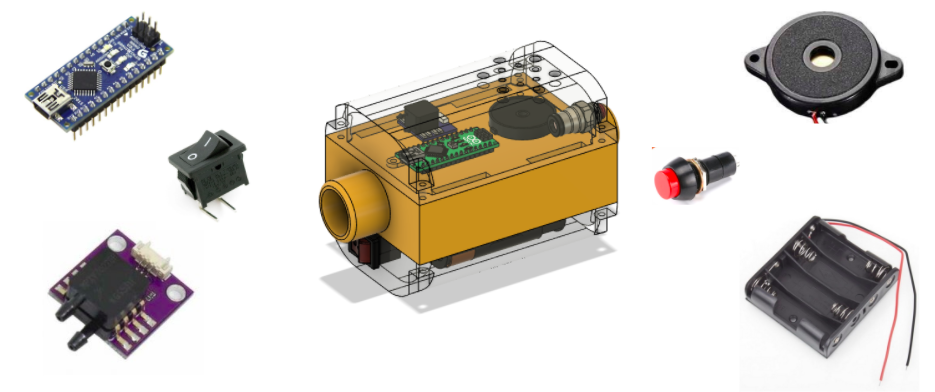

# COVID19-VentilatorAlarm
A 3D Printable and Arduino-based Alarm System for monitoring Ventilator Airflow

How to Make the Alarm System:
1) Purchase the electronic hardware components
1) Download and 3D print all three hardware components
3) Download the code and upload it to the Arduino Board
