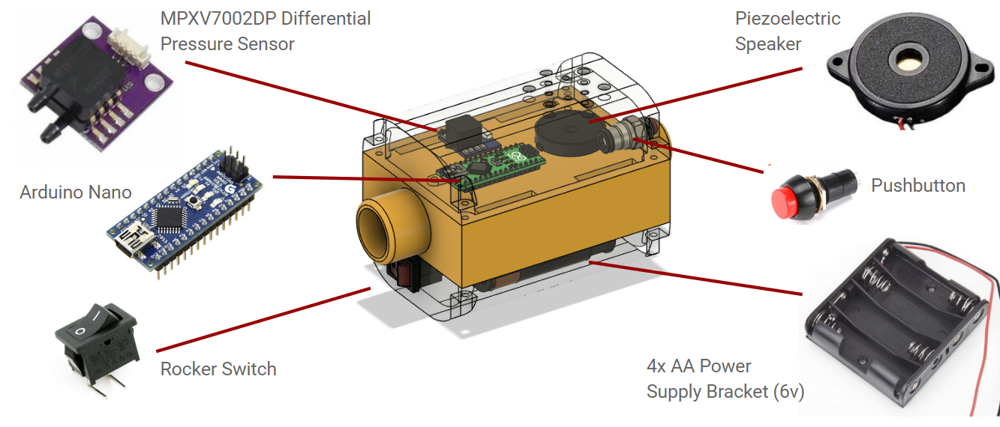
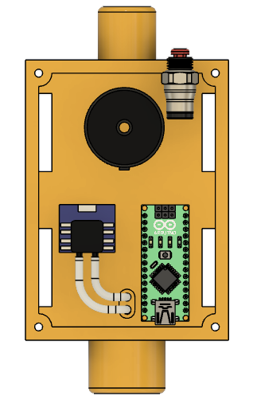
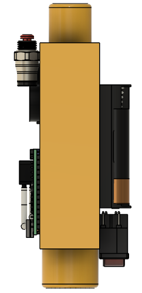
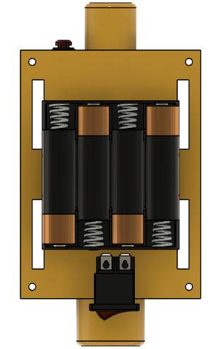
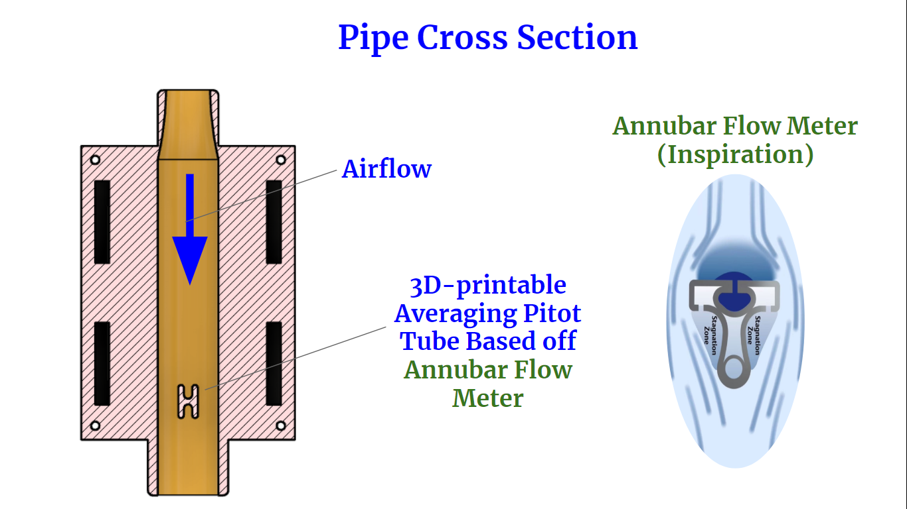
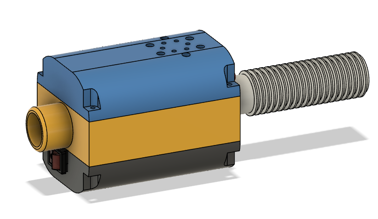
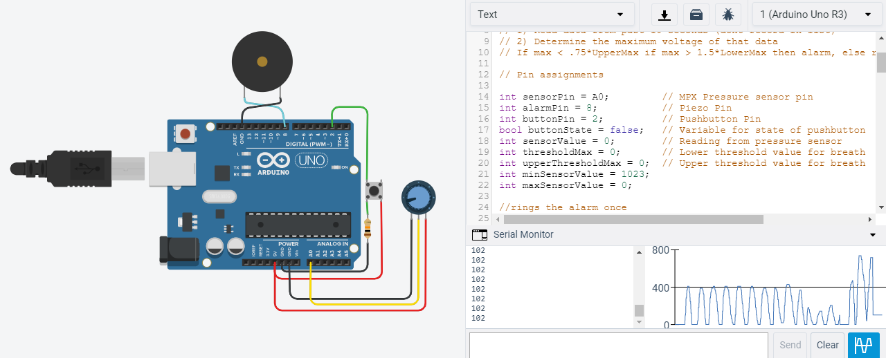

________________________________________________________________________________________________________________________________

   

.PNG) .PNG) .PNG) 

#                             Code Simulated Using Autodesk Tinkercad

## How to Make the Alarm System:
### 1) Purchase all electronic components listed in the Required_Parts Folder
### 2) Download .STL files from the 3D_Printed_Parts Folder
### 3) 3D Print the files (we recommend using PLA plastic at >50% infill)
### 4) Assemble the plastic and electric parts to specification as seen in the Pictures Folder
### 5) Download the code from the Arduino_Code Folder and upload it to the Arduino Board

### 6) Contact me at knf37@cornell.edu for any questions

